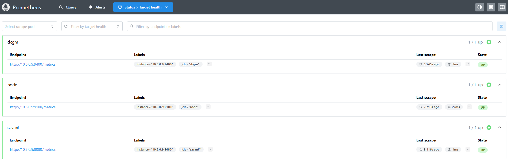
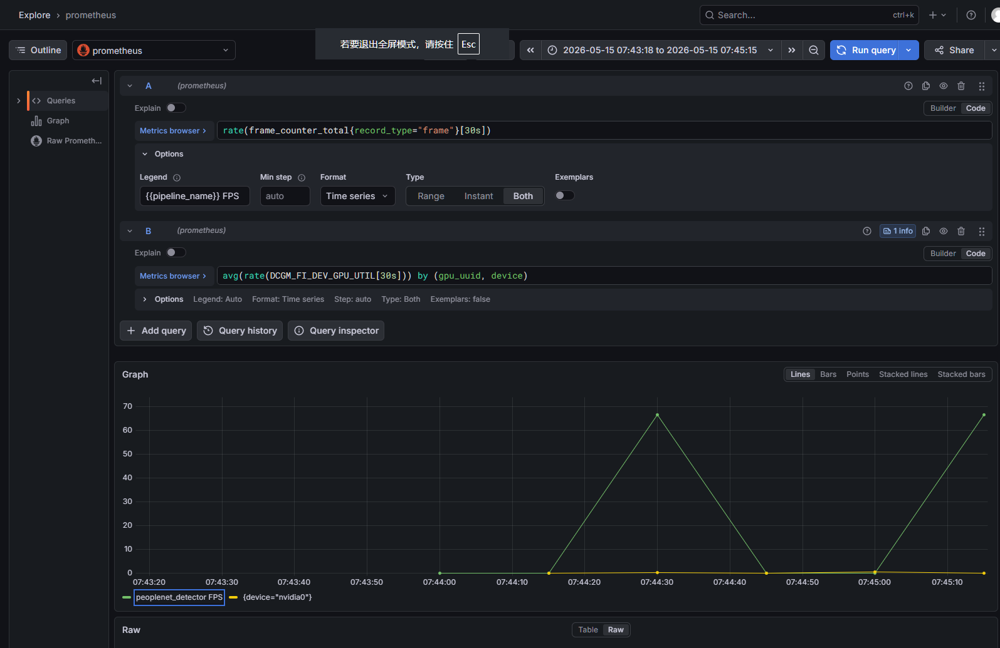

# 任务十 运维与监控看板(Observability)

## 1.docker运行grafana

```bash
docker run -d -p 3000:3000 --name=grafana grafana/grafana-oss
```

grafana的主要作用是提供数据可视化功能。

## 2.docker运行node exporter

```bash
docker run -d \
  --name node-exporter \
  --net host \
  --restart always \
  prom/node-exporter
```

cgm exporter的作用是采集CPU、内存等指标

## 3.docker运行dcgm exporter

```bash
docker run -d \
 --name dcgm-exporter \
 --net host \
 --privileged \
 --runtime nvidia \
 --restart always \
 nvidia/dcgm-exporter:latest
```

dcgm exporter的作用是采集GPU、显存等指标

## 4.docker运行prometheus

```bash
docker run -d \
  --name prometheus \
  -p 9090:9090 \
  --restart always \
  -v ~/prometheus/prometheus.yml:/etc/prometheus/prometheus.yml \
  prom/prometheus
```

prometheus的主要作用是采集存储数据。

## 5.查看监控结果

1.云外访问
服务器ip:9090
可以查看prometheus对数据源的数据采集状态，若为UP，则说明状态采集正常。


2.云外访问
服务器ip:3000，添加prometheus数据源后
即可查看grafana的监控结果，输入对应监控指标的查询语句，即可查看图形化的监控指标变化。

如FPS的查询语句为：

rate(frame_counter_total{record_type="frame"}[30s])

GPU利用率的查询语句为：

avg(rate(DCGM_FI_DEV_GPU_UTIL[30s])) by (gpu_uuid, device)


